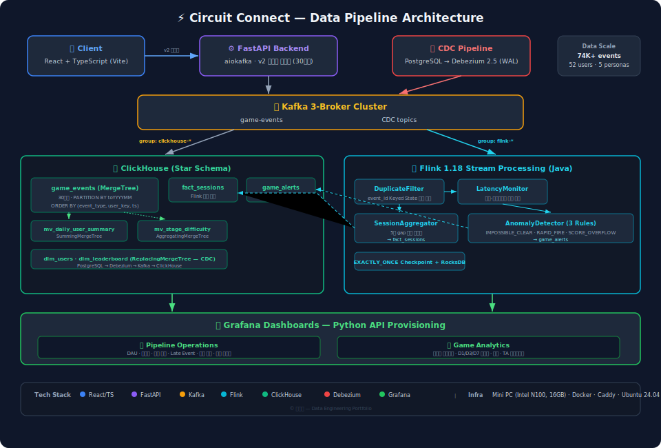
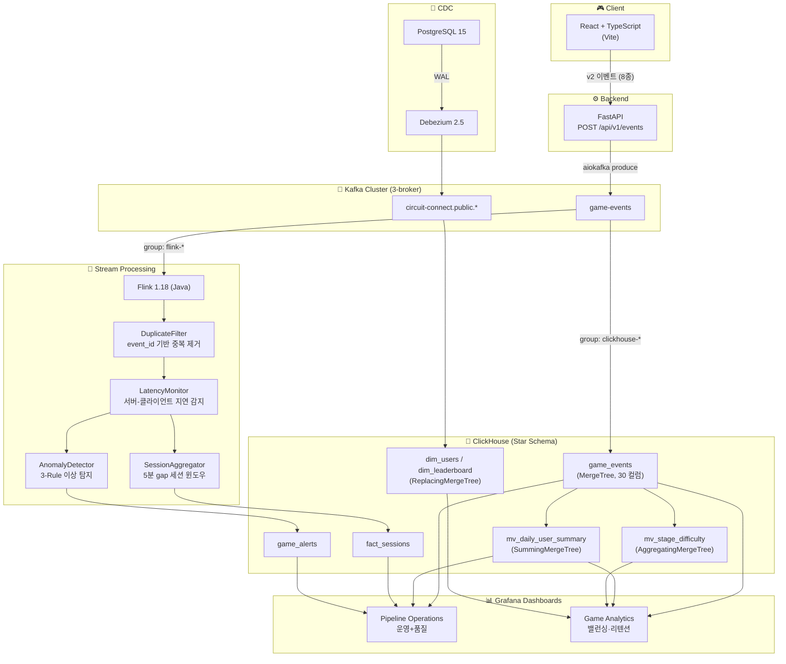
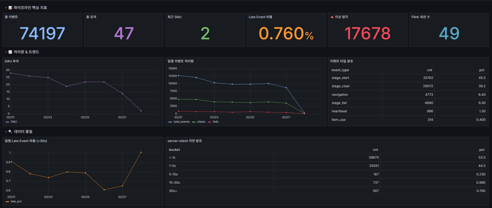
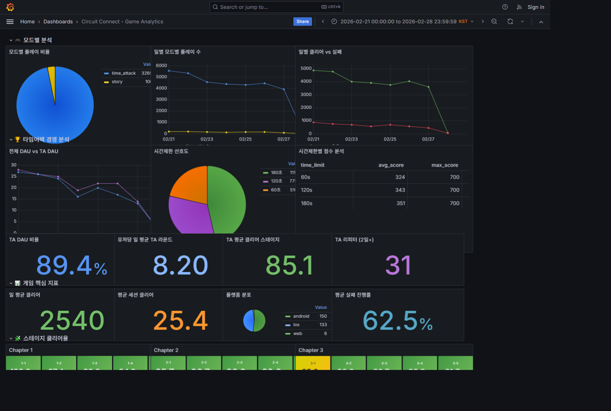

# ⚡ Circuit Connect — "불을 켜줘!"

> **실시간 데이터 파이프라인이 내장된 퍼즐 게임**  
> 토스 앱인토스 미니앱 + 데이터 엔지니어링 포트폴리오

<br>

## 📌 프로젝트 요약

| 항목 | 내용 |
|------|------|
| **한 줄 요약** | 퍼즐 게임의 유저 행동 이벤트를 실시간으로 수집·처리·분석하는 End-to-End 데이터 파이프라인 |
| **게임** | 전선을 연결해 전구에 불을 켜는 논리 퍼즐 (스토리 5챕터 × 10스테이지 + 타임어택) |
| **핵심 스택** | React · FastAPI · Kafka · Flink · ClickHouse · Grafana |
| **인프라** | 미니PC 홈서버 24/7 운영 (Intel N100, 16GB RAM, Ubuntu 24.04) |
| **데이터 규모** | 74K+ 이벤트, 52명 유저 시뮬레이션 (5가지 페르소나) |

<br>

## 🏗️ 아키텍처

<p align="center">
  
</p>

<details>
<summary>Mermaid 소스 (클릭하여 펼치기)</summary>



</details>

<br>

## 📸 대시보드 스크린샷

### Pipeline Operations — 운영 현황 + 데이터 품질 모니터링
<p align="center">
  
</p>

> DAU 추이, 이벤트 처리량, 이상 탐지 현황, Late Event 비율, 지연 분포, 필드 채움률을 통합 모니터링.

### Game Analytics — 밸런싱 · 리텐션 · TA 경쟁 분석
<p align="center">
  
</p>

> 챕터별 클리어율 히트맵, 모드별 플레이 비율, D1/D3/D7 리텐션, 타임어택 스코어보드, 스토리 퍼널 분석.

<br>

## 🔧 기술 스택

| 레이어 | 기술 | 선택 이유 |
|--------|------|----------|
| **프론트엔드** | React + TypeScript (Vite) | 토스 앱인토스 미니앱 호환, 빠른 HMR |
| **백엔드** | FastAPI + aiokafka | 비동기 이벤트 프로듀싱, 자동 API 문서화 |
| **메시지 브로커** | Apache Kafka (3-broker) | Consumer Group 기반 다중 소비, 내구성 보장 |
| **스트림 처리** | Apache Flink 1.18 (Java) | Keyed State 기반 중복 제거, 세션 윈도우, 이상 탐지 |
| **분석 DB** | ClickHouse | 컬럼 지향 OLAP, MergeTree 기반 실시간 집계 |
| **CDC** | Debezium 2.5 | PostgreSQL WAL → Kafka, 유저/리더보드 실시간 동기화 |
| **시각화** | Grafana | API 프로비저닝, 대시보드 2종 자동 배포 |
| **인프라** | Docker Compose · Caddy · Ubuntu 24.04 | 미니PC 홈서버 24/7 운영 |

<br>

## 📦 프로젝트 구조

```
circuit-connect/
├── frontend/                          # React 프론트엔드
│   └── circuit-connect/
│       └── src/
│           ├── api/events.ts          # 이벤트 전송 (trackEvent, sendBeacon)
│           ├── components/            # 게임 UI 컴포넌트
│           └── App.tsx
├── circuit-connect-backend/           # FastAPI 백엔드
│   └── app/
│       ├── routers/events.py          # POST /api/v1/events
│       ├── services/event_service.py  # v2 정형 필드 추출 + Kafka produce
│       └── core/kafka.py              # aiokafka 프로듀서
├── pipeline/
│   └── flink/                         # Flink 스트림 처리 (Java)
│       ├── pom.xml
│       ├── Dockerfile                 # Multi-stage 빌드 (44MB fat JAR)
│       └── src/main/java/com/circuit/flink/
│           ├── CircuitConnectJob.java # 메인 Job
│           ├── model/                 # GameEvent, SessionSummary, AnomalyAlert
│           ├── function/              # 4개 처리 함수
│           └── sink/                  # ClickHouse JDBC Sink
├── simulation/
│   ├── simulate_game_events.py        # 시뮬레이션 데이터 생성기
│   └── provision_dashboards_v3.py     # Grafana 대시보드 자동 프로비저닝
└── infra/                             # Caddy, DNS 설정
```

<br>

## 🎯 핵심 구현 상세

### 1. 이벤트 스키마 정형화 (Phase A)

이벤트 13종 → 8종으로 통합, `schema_version: "2"` 적용.

| 이벤트 | 설명 |
|--------|------|
| `session_start` / `session_end` | 세션 라이프사이클 |
| `stage_start` / `stage_clear` / `stage_fail` | 스테이지 플레이 결과 |
| `item_use` | 만능블럭 구매/사용 |
| `navigation` | 화면 이동 퍼널 |
| `heartbeat` | 세션 활성 상태 확인 |

비정형 JSON payload → **30개 정형 컬럼**으로 추출하여 ClickHouse에서 바로 분석 쿼리 가능.

### 2. ClickHouse Star Schema (Phase B)

```
┌─ Fact ────────────────────────────────────────┐
│  game_events (MergeTree, 30 컬럼)             │
│  → PARTITION BY toYYYYMM(event_date)          │
│  → ORDER BY (event_type, user_key, timestamp) │
│  → TTL 6 MONTH                                │
└─────┬───────────────┬─────────────────────────┘
      │               │
      ▼               ▼
mv_daily_user_summary  mv_stage_difficulty
(SummingMergeTree)     (AggregatingMergeTree)
```

설계 포인트:
- **LowCardinality**: 카디널리티 낮은 필드(mode, event_type 등) → 딕셔너리 인코딩으로 압축률 극대화
- **Sparse Column**: 모든 이벤트가 30개 컬럼을 채울 필요 없음 → DEFAULT 값으로 효율적 저장
- **MV 자동 집계**: INSERT 시점에 일별 요약/스테이지 난이도가 자동 갱신

### 3. Flink 실시간 스트림 처리 (Phase C)

4개 처리 함수가 **면접에서 자주 나오는 질문에 직접 대응**:

| 면접 질문 | Flink 해결 | 구현체 |
|-----------|-----------|--------|
| "이벤트 중복은 어떻게 처리?" | event_id 기반 Keyed State + TTL 1시간 | `DuplicateFilter` |
| "Kafka 장애 시 데이터 보장?" | EXACTLY_ONCE Checkpointing + RocksDB | Flink 설정 |
| "클라이언트 데이터 유실 방지?" | 서버사이드 이벤트 카운터 + 지연 경고 | `LatencyMonitor` |
| "실시간 이상 탐지?" | 3가지 Rule 기반 탐지 | `AnomalyDetector` |

#### 이상 탐지 규칙 (AnomalyDetector)

| Rule | 조건 | 의미 |
|------|------|------|
| `IMPOSSIBLE_CLEAR` | clear_time < 500ms | 비정상적으로 빠른 클리어 (봇 의심) |
| `RAPID_FIRE` | 1분 내 20+ stage_clear | 매크로/자동화 의심 |
| `SCORE_OVERFLOW` | score > 그리드별 max_score | 점수 조작 의심 |

#### 세션 윈도우 집계 (SessionAggregator)

5분 gap 기반 세션 윈도우로 유저별 세션을 자동 분할하고, `fact_sessions` 테이블에 세션 요약(소요시간, 클리어 수, 실패 수, 총 이벤트 수)을 적재.

### 4. CDC 파이프라인 (Debezium)

PostgreSQL의 유저 정보와 리더보드 데이터를 **WAL 기반 CDC**로 ClickHouse에 실시간 동기화.

```
PostgreSQL → Debezium 2.5 → Kafka → ClickHouse
(dim_users, dim_leaderboard — ReplacingMergeTree)
```

Consumer Group 분리로 기존 암호화폐 CDC 파이프라인과 **간섭 없이 공존**.

### 5. Grafana 대시보드 (Phase D/F)

Python 스크립트로 **Grafana API 자동 프로비저닝** — 코드 기반 대시보드 관리.

| 대시보드 | 목적 | 주요 패널 |
|----------|------|-----------|
| **Pipeline Operations** | 운영 현황 + 데이터 품질 | DAU 추이, 이벤트 처리량, 이상 탐지, Late Event 비율, 지연 분포, 필드 채움률 |
| **Game Analytics** | 밸런싱 · 리텐션 · TA 경쟁 | 챕터별 클리어율 히트맵, 퍼널, D1/D3/D7 리텐션, TA 스코어보드 |

### 6. 시뮬레이션 데이터 (Phase E)

5가지 유저 페르소나로 현실적인 행동 패턴을 시뮬레이션:

| 페르소나 | 인원 | 특징 |
|---------|------|------|
| 헤비유저 | 5명 | 매일 접속, Ch.5까지 진행, story+TA 병행 |
| 일반유저 | 15명 | 주 3~4일, Ch.3까지 |
| 캐주얼유저 | 15명 | 주 1~3일, Ch.2까지 |
| 이탈유저 | 10명 | 가입 후 2~3일만 활동 |
| 봇유저 | 3명 | clear_time < 300ms, 점수 오버플로 → 이상 탐지 대상 |

7일간 74K+ 이벤트를 Kafka에 직접 produce하여 전체 파이프라인 E2E 검증.

<br>

## 🗄️ 인프라 구성

| 컨테이너 | 역할 | 비고 |
|----------|------|------|
| `circuit-connect-api` | FastAPI 백엔드 | aiokafka produce |
| `cdc-kafka-1/2/3` | Kafka 3-broker 클러스터 | Consumer Group 기반 다중 소비 |
| `cdc-clickhouse` | ClickHouse | Star Schema + MV |
| `cdc-flink-jobmanager` | Flink JobManager | Web UI 제공 |
| `cdc-flink-taskmanager` | Flink TaskManager (3 slots) | 2개: CDC, 1개: Circuit Connect |
| `cdc-kafka-connect` | Debezium 2.5 | PostgreSQL CDC |
| `cdc-grafana` | Grafana | 대시보드 2종 |
| `my-postgres` | PostgreSQL 15 | 유저 · 리더보드 원본 |

Flink TaskManager 3 slot 중 2개는 기존 암호화폐 CDC Job이 사용하고, 1개를 Circuit Connect 전용으로 운영 — **한정된 리소스에서의 멀티 Job 공존 설계**.

<br>

## 🔑 설계 의사결정 기록

| 결정 | 이유 |
|------|------|
| **Kafka Consumer Group 분리** | ClickHouse(raw 저장)와 Flink(스트림 처리)가 같은 토픽을 독립적으로 소비 |
| **RAPID_FIRE threshold 10→20** | 시뮬레이션 데이터의 burst 특성 (17초에 66K 이벤트)으로 false positive 발생 → 실환경 기준으로 조정 |
| **seq 필드 도입 (전 레이어)** | 프론트→백엔드→Flink→ClickHouse 전 구간에서 이벤트 순서 보장 및 유실 감지 |
| **봇 필터링 (쿼리 레벨)** | 봇 데이터를 삭제하지 않고 보존하되, 분석 쿼리에서 `user_key NOT LIKE 'user_bot%'`로 제외 — 이상 탐지 대시보드에서는 활용 |
| **Grafana API 프로비저닝** | 수동 대시보드 관리 대신 Python 스크립트로 코드화 → 버전 관리, 재현 가능성 확보 |
| **Star Schema + MV** | INSERT 시점에 자동 집계로 쿼리 시점 부하 감소, 미니PC 리소스 제약 대응 |

<br>

## 🚀 실행 방법

### 사전 요구사항
- Docker & Docker Compose
- Python 3.10+
- Node.js 18+
- Java 11 (Flink 빌드 시)

### 1. 인프라 실행

```bash
# Kafka, ClickHouse, Flink, Grafana, PostgreSQL
cd ~/cdc-realtime-pipeline
docker compose up -d

# 백엔드
cd ~/circuit-connect/circuit-connect-backend
docker compose up -d
```

### 2. Flink Job 배포

```bash
cd ~/circuit-connect/pipeline/flink
./build.sh  # Docker Multi-stage 빌드 → fat JAR 생성
# Flink Web UI에서 JAR 업로드 및 실행
```

### 3. 시뮬레이션 데이터 생성

```bash
cd ~/circuit-connect/simulation
python3 simulate_game_events.py          # 74K 이벤트 생성
python3 provision_dashboards_v3.py       # Grafana 대시보드 배포
```

### 4. 프론트엔드 실행

```bash
cd ~/circuit-connect/frontend/circuit-connect/circuit-connect
npm install && npm run dev
```

<br>

## 📈 개발 과정 (Phase별)

```
Phase A  이벤트 스키마 정형화     13종→8종, schema_version "2", 30 컬럼
   ↓
Phase B  ClickHouse Star Schema   Fact + MV + CDC (Debezium → dim 테이블)
   ↓
Phase C  Flink 실시간 처리        중복제거·지연감지·세션집계·이상탐지
   ↓
Phase D  Grafana 대시보드          Pipeline Operations + Game Analytics
   ↓
Phase E  시뮬레이션 데이터         5 페르소나, 74K 이벤트, 7일 E2E 검증
   ↓
Phase F  대시보드 고도화 (v3)      TA 경쟁 스코어보드, 색상 체계, 레이아웃 최적화
```

<br>

## 📝 License

This project is for portfolio and educational purposes.

---

*Built by 이준서 — 데이터 엔지니어링 포트폴리오 프로젝트*
