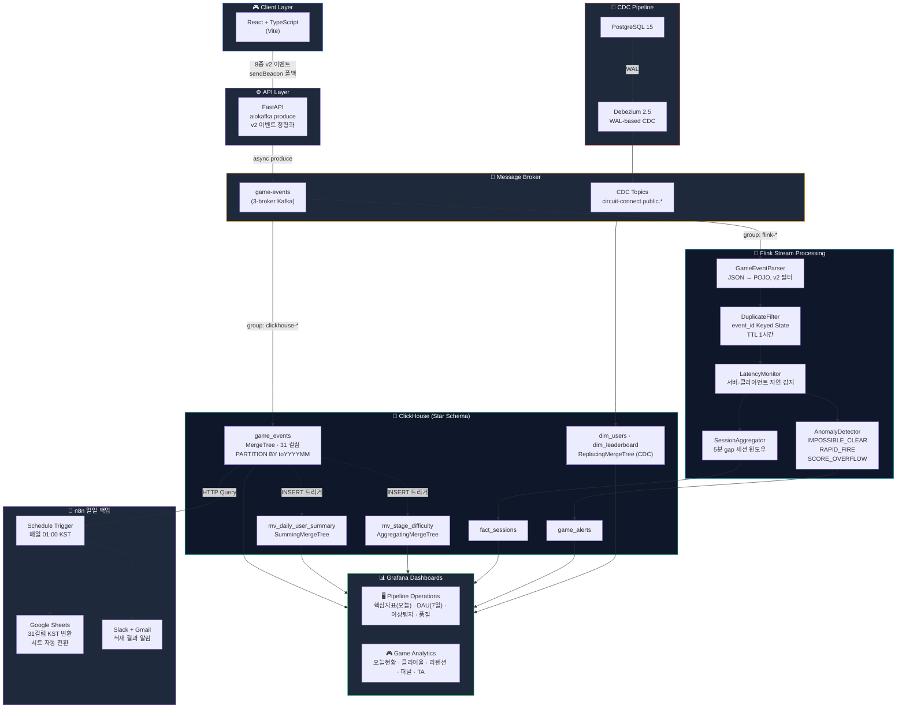

```mermaid
flowchart TB
    subgraph CLIENT["🎮 Client Layer"]
        FE["React + TypeScript<br/>(Vite)"]
    end

    subgraph BACKEND["⚙️ API Layer"]
        API["FastAPI<br/>aiokafka produce<br/>v2 이벤트 정형화"]
    end

    subgraph KAFKA["📨 Message Broker"]
        direction LR
        GE["game-events<br/>(3-broker Kafka)"]
        CDC_T["CDC Topics<br/>circuit-connect.public.*"]
    end

    subgraph FLINK["🔄 Flink Stream Processing"]
        direction TB
        PARSE["GameEventParser<br/>JSON → POJO, v2 필터"]
        DUP["DuplicateFilter<br/>event_id Keyed State<br/>TTL 1시간"]
        LAT["LatencyMonitor<br/>서버-클라이언트 지연 감지"]
        SESS["SessionAggregator<br/>5분 gap 세션 윈도우"]
        ANOM["AnomalyDetector<br/>IMPOSSIBLE_CLEAR<br/>RAPID_FIRE<br/>SCORE_OVERFLOW"]
    end

    subgraph CH["💾 ClickHouse (Star Schema)"]
        direction TB
        FACT["game_events<br/>MergeTree · 31 컬럼<br/>PARTITION BY toYYYYMM"]
        MV_DAILY["mv_daily_user_summary<br/>SummingMergeTree"]
        MV_STAGE["mv_stage_difficulty<br/>AggregatingMergeTree"]
        F_SESS["fact_sessions"]
        F_ALERT["game_alerts"]
        DIM["dim_users · dim_leaderboard<br/>ReplacingMergeTree (CDC)"]
    end

    subgraph CDC_PIPE["🔁 CDC Pipeline"]
        PG["PostgreSQL 15"]
        DBZ["Debezium 2.5<br/>WAL-based CDC"]
    end

    subgraph GRAFANA["📊 Grafana Dashboards"]
        direction LR
        G1["🖥️ Pipeline Operations<br/>핵심지표(오늘) · DAU(7일) · 이상탐지 · 품질"]
        G2["🎮 Game Analytics<br/>오늘현황 · 클리어율 · 리텐션 · 퍼널 · TA"]
    end

    subgraph N8N["📁 n8n 일일 백업"]
        direction LR
        SCHED["Schedule Trigger<br/>매일 01:00 KST"]
        GS["Google Sheets<br/>31컬럼 KST 변환<br/>시트 자동 전환"]
        ALERT["Slack + Gmail<br/>적재 결과 알림"]
    end

    FE -->|"8종 v2 이벤트<br/>sendBeacon 폴백"| API
    API -->|"async produce"| GE

    GE -->|"group: clickhouse-*"| FACT
    GE -->|"group: flink-*"| PARSE

    PARSE --> DUP --> LAT
    LAT --> SESS --> F_SESS
    LAT --> ANOM --> F_ALERT

    FACT -.->|"INSERT 트리거"| MV_DAILY
    FACT -.->|"INSERT 트리거"| MV_STAGE

    PG -->|"WAL"| DBZ --> CDC_T --> DIM

    FACT & MV_DAILY & MV_STAGE & F_SESS & F_ALERT & DIM --> GRAFANA

    FACT -->|"HTTP Query"| SCHED --> GS
    SCHED --> ALERT

    style CLIENT fill:#1e293b,stroke:#3b82f6,color:#fff
    style BACKEND fill:#1e293b,stroke:#8b5cf6,color:#fff
    style KAFKA fill:#1e293b,stroke:#f59e0b,color:#fff
    style FLINK fill:#0f172a,stroke:#06b6d4,color:#fff
    style CH fill:#0f172a,stroke:#10b981,color:#fff
    style CDC_PIPE fill:#1e293b,stroke:#ef4444,color:#fff
    style GRAFANA fill:#1e293b,stroke:#22c55e,color:#fff
    style N8N fill:#1e293b,stroke:#a855f7,color:#fff
```
